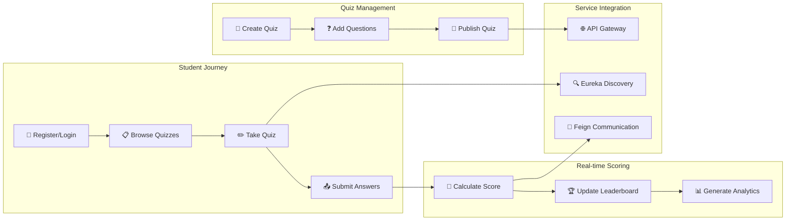

# Quiz Application System

A full-stack quiz platform built with microservices architecture for real-time quiz creation, management, and scoring. Features scalable Spring Boot services with React frontend and comprehensive service discovery.

## What It Does

**Quiz Platform Journey:**
1. **Quiz Creation** → Admin creates quizzes with multiple questions and answers
2. **User Management** → Registration, authentication, and profile management
3. **Real-time Quizzing** → Students take quizzes with instant feedback and scoring
4. **Results & Analytics** → Comprehensive scoring, leaderboards, and performance tracking
5. **Microservices Communication** → Service discovery and load balancing across distributed services
   
## Microservices Flow



## Tech Stack

**Frontend:** React.js, JavaScript, CSS3, Responsive Design  
**Backend:** Spring Boot, Spring Cloud, Java 11+  
**Microservices:** Netflix Eureka (Service Discovery), OpenFeign (Inter-service Communication)  
**API Management:** Spring Cloud Gateway, CORS Configuration  
**Database:** MongoDB (Document Database)  
**Architecture:** Microservices, RESTful APIs, Service-Oriented Architecture

## Key Features

- 📝 **Quiz Management** - Create, edit, and manage quizzes with multiple question types
- 👥 **User Management** - Registration, authentication, and profile management
- ⚡ **Real-time Scoring** - Instant feedback and score calculation during quiz attempts
- 🏆 **Leaderboards** - Comprehensive ranking and performance analytics
- 🔍 **Service Discovery** - Netflix Eureka for automatic service registration and discovery
- 🌐 **API Gateway** - Centralized routing, load balancing, and CORS handling
- 🔗 **Inter-service Communication** - OpenFeign for seamless microservice communication
- 📊 **Analytics Dashboard** - Performance metrics and quiz statistics

## Project Structure

```
quiz-application/
├── frontend/
│   ├── src/
│   │   ├── components/       # React components
│   │   ├── pages/           # Quiz, Dashboard, Results pages
│   │   ├── services/        # API service calls
│   │   └── utils/           # Helper functions
│   └── public/
├── backend/
│   ├── eureka-server/       # Service discovery
│   ├── api-gateway/         # Gateway service
│   ├── quiz-service/        # Quiz CRUD operations
│   ├── user-service/        # User management
│   ├── scoring-service/     # Score calculation
│   └── config-server/       # Configuration management
└── docker-compose.yml       # Multi-container deployment
```

## Quick Start

```bash
# Clone repository
git clone <your-repo-url>
cd quiz-application

# Start Eureka Server
cd eureka-server
mvn spring-boot:run

# Start API Gateway
cd ../api-gateway
mvn spring-boot:run

# Start Microservices
cd ../quiz-service && mvn spring-boot:run &
cd ../user-service && mvn spring-boot:run &
cd ../scoring-service && mvn spring-boot:run &

# Start Frontend
cd ../frontend
npm install && npm start
```

## Microservices Configuration

```yaml
# application.yml (Quiz Service)
server:
  port: 8081
eureka:
  client:
    service-url:
      defaultZone: http://localhost:8761/eureka/
spring:
  application:
    name: quiz-service
  data:
    mongodb:
      uri: mongodb://localhost:27017/quizdb
```

---
**Scalable microservices-based quiz platform with modern Spring Cloud architecture**
