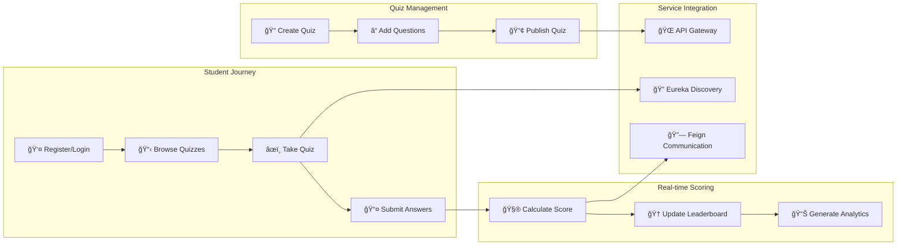

# Quiz Application System

A full-stack quiz platform built with microservices architecture for real-time quiz creation, management, and scoring. Features scalable Spring Boot services with React frontend and comprehensive service discovery.

## What It Does

**Quiz Platform Journey:**
1. **Quiz Creation** → Admin creates quizzes with multiple questions and answers
2. **User Management** → Registration, authentication, and profile management
3. **Real-time Quizzing** → Students take quizzes with instant feedback and scoring
4. **Results & Analytics** → Comprehensive scoring, leaderboards, and performance tracking
5. **Microservices Communication** → Service discovery and load balancing across distributed services

## System Architecture

```mermaid
graph TB
    %% Users
    ADMIN[👨‍💼 Admin<br/>Quiz Creator]
    STUDENT[👤 Student<br/>Quiz Taker]
    
    %% Frontend
    REACT[⚛️ React Frontend<br/>SPA Application]
    
    %% API Gateway
    GATEWAY[🌐 API Gateway<br/>Route Management<br/>CORS Handling]
    
    %% Service Discovery
    EUREKA[🔍 Netflix Eureka<br/>Service Registry<br/>Discovery Server]
    
    %% Microservices
    QUIZ_SVC[📝 Quiz Service<br/>CRUD Operations<br/>Question Management]
    USER_SVC[👥 User Service<br/>Authentication<br/>Profile Management]
    SCORE_SVC[📊 Scoring Service<br/>Results Calculation<br/>Analytics]
    
    %% Inter-service Communication
    FEIGN[🔗 OpenFeign<br/>Service-to-Service<br/>HTTP Clients]
    
    %% Database
    MONGO[(🍃 MongoDB<br/>Document Storage<br/>Quiz Data)]
    
    %% Infrastructure
    CONFIG[⚙️ Config Server<br/>Centralized Config]
    
    %% User Flow
    ADMIN --> REACT
    STUDENT --> REACT
    REACT --> GATEWAY
    
    %% Gateway Routing
    GATEWAY --> QUIZ_SVC
    GATEWAY --> USER_SVC
    GATEWAY --> SCORE_SVC
    
    %% Service Discovery
    QUIZ_SVC --> EUREKA
    USER_SVC --> EUREKA
    SCORE_SVC --> EUREKA
    GATEWAY --> EUREKA
    
    %% Inter-service Communication
    SCORE_SVC --> FEIGN
    FEIGN --> QUIZ_SVC
    FEIGN --> USER_SVC
    
    %% Data Layer
    QUIZ_SVC --> MONGO
    USER_SVC --> MONGO
    SCORE_SVC --> MONGO
    
    %% Configuration
    CONFIG -.-> QUIZ_SVC
    CONFIG -.-> USER_SVC
    CONFIG -.-> SCORE_SVC
    CONFIG -.-> GATEWAY
    
    %% Styling
    classDef user fill:#e3f2fd,stroke:#1565c0,stroke-width:2px,color:#0d47a1
    classDef frontend fill:#f3e5f5,stroke:#7b1fa2,stroke-width:2px,color:#4a148c
    classDef gateway fill:#fff3e0,stroke:#ef6c00,stroke-width:2px,color:#e65100
    classDef discovery fill:#e8f5e8,stroke:#2e7d32,stroke-width:2px,color:#1b5e20
    classDef microservice fill:#e1f5fe,stroke:#0277bd,stroke-width:2px,color:#01579b
    classDef communication fill:#fce4ec,stroke:#c2185b,stroke-width:2px,color:#880e4f
    classDef database fill:#f1f8e9,stroke:#558b2f,stroke-width:2px,color:#33691e
    classDef config fill:#fff8e1,stroke:#f9a825,stroke-width:2px,color:#f57f17
    
    class ADMIN,STUDENT user
    class REACT frontend
    class GATEWAY gateway
    class EUREKA discovery
    class QUIZ_SVC,USER_SVC,SCORE_SVC microservice
    class FEIGN communication
    class MONGO database
    class CONFIG config
```



## Microservices Flow



## Tech Stack

**Frontend:** React.js, JavaScript, CSS3, Responsive Design  
**Backend:** Spring Boot, Spring Cloud, Java 11+  
**Microservices:** Netflix Eureka (Service Discovery), OpenFeign (Inter-service Communication)  
**API Management:** Spring Cloud Gateway, CORS Configuration  
**Database:** MongoDB (Document Database)  
**Architecture:** Microservices, RESTful APIs, Service-Oriented Architecture

## Key Features

- 📝 **Quiz Management** - Create, edit, and manage quizzes with multiple question types
- 👥 **User Management** - Registration, authentication, and profile management
- ⚡ **Real-time Scoring** - Instant feedback and score calculation during quiz attempts
- 🏆 **Leaderboards** - Comprehensive ranking and performance analytics
- 🔍 **Service Discovery** - Netflix Eureka for automatic service registration and discovery
- 🌐 **API Gateway** - Centralized routing, load balancing, and CORS handling
- 🔗 **Inter-service Communication** - OpenFeign for seamless microservice communication
- 📊 **Analytics Dashboard** - Performance metrics and quiz statistics

## Project Structure

```
quiz-application/
├── frontend/
│   ├── src/
│   │   ├── components/       # React components
│   │   ├── pages/           # Quiz, Dashboard, Results pages
│   │   ├── services/        # API service calls
│   │   └── utils/           # Helper functions
│   └── public/
├── backend/
│   ├── eureka-server/       # Service discovery
│   ├── api-gateway/         # Gateway service
│   ├── quiz-service/        # Quiz CRUD operations
│   ├── user-service/        # User management
│   ├── scoring-service/     # Score calculation
│   └── config-server/       # Configuration management
└── docker-compose.yml       # Multi-container deployment
```

## Quick Start

```bash
# Clone repository
git clone <your-repo-url>
cd quiz-application

# Start Eureka Server
cd eureka-server
mvn spring-boot:run

# Start API Gateway
cd ../api-gateway
mvn spring-boot:run

# Start Microservices
cd ../quiz-service && mvn spring-boot:run &
cd ../user-service && mvn spring-boot:run &
cd ../scoring-service && mvn spring-boot:run &

# Start Frontend
cd ../frontend
npm install && npm start
```

## Microservices Configuration

```yaml
# application.yml (Quiz Service)
server:
  port: 8081
eureka:
  client:
    service-url:
      defaultZone: http://localhost:8761/eureka/
spring:
  application:
    name: quiz-service
  data:
    mongodb:
      uri: mongodb://localhost:27017/quizdb
```

---
**Scalable microservices-based quiz platform with modern Spring Cloud architecture**
